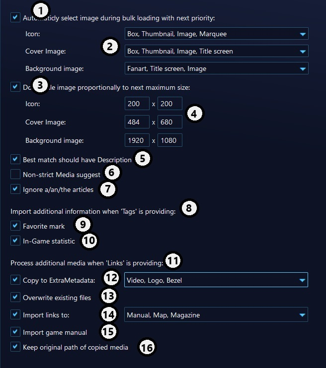

[help_content]: # (start)
# EmulationStation Metadata Source For Playnite
[help_content]: # (end)

   

[help_content]: # (start)
EmulationStation is a graphical and themeable emulator front-end. It is well-known in retrogaming, and many retrogame emulators setup based on it, e.g. Retrobat, Batocera, RecallBox, RetroPie.

So if you are in Retrogaming word - most probably you already have your ROM collection, with your favourite covers and gameplay video. May be you spend many time to collect and polish it.

This Metadata source is aimed to help you to import your collection to Playnite.

[Latest Release](https://github.com/ashpynov/ESMetadata/releases/latest)

## Functions and Limitation

The set of game info media do not the same between Playnite and EmulationStation. For example here is no native support of Video or Logo. But huge set of Playnite Extension will help you. E.g. ExtraMetadata extension are supported by many themes and will help you to add Video and logos to you game.

But there in no API to deal with it. So This Source will use a little tricks:
- Some information like 'Favorite' mark or In-game statistic are imported if 'Tags' is requested from source.
- Additional media resurces like Video, logo, bezel, fanart, manual may are imported as 'Links'

To be able be used as media for ExtraMetadata extension - files may be copied to Extrametadata folder. Also you may setup:
- Copy some media from you collection,
- Just save link to media from your collection
- If file was copied, you may keep link to original or replace it to link to copied media.

For sure you may choose priority of sources for Icon, cover, or background and downscale sizes.

Name of game does not imported on automation metadata load (Playnite implementation)

### Supported gamelist.xml fields

Here the list of field supported by:

Metadata:
- Name,
- Desc,
- Genre,
- Region,
- ReleaseDate,
- Rating,
- Developer,
- Publisher,
- Favorite,
- PlayCount,
- LastPlayed,
- GameTime

Media:
- Path,
- Image,
- Thumbnail,
- Marquee,
- Fanart,
- Video,
- Bezel,
- Manual,
- Boxback,
- Box,
- Magazine,
- Map,
- TitleShot

### Game record choosing and Fuzzy match

By default record in collection look up by ROM path. If you collection is mature enough and organized - it should be enought. Colection is searching from closest one to ROM location. (Common structure is => roms/platform/rom_files + gamelist.xml )

But if your collection same as mine: ROM name dont match, some copy of ROM with different names, some added rom just-to-play or modified. Without description... Fuzzy search will try to find most somilar Best filled game in collection.

The mark of 'not filled game' is absence of description field. So if field is absence - it will try to find next best match with description.

What is 'best match'? it will try to compare ROM filename and name with Game name, during comparasion it may ignote articles, underscores and simbols. And allow some difference between. So sometime it will give errors. Cause `eaarth worm jim 2" is real close to 'earthworm jim'.

But in any case - if you have several version of game, you may choose to suggest also images from other similar games.

## Configuration options description

### Priorities of sources
1. During automatic download of metadata on Library update this will choose image for Icon, Cover and Background automaticly.
2. In the drop-down select kind of images to use and preference. It will select first available image in specified list. You may use checkbox at left of popup to enable/disable source and button at right side to change order.
3. Option to ensure that image will not be too huge for items. Selected image will be downscale proportionally to maximum alowed size.
4. Specify maximum size for width and height.

### Fuzzy search
5. You game importing collection may contain items without usefull information. Usually it is game added automaticly or recently, some variation of already existed game just to play once. Absence of description will trigger to fuzzy search next closest record to import info from.
6. But when you editing game manualy - this option give you chance to see and choose picture from other similar game.
7. During fuzzy matching the articles order in game name may be different or absent. This will remove articles during name compare.

### Additional data section
8. Playnite Metadata source API does not support some field specification, for example Favorite mark, or In-game statistic like 'Last played' time.

   So EmulationStation Metadata source extension directly import this information as soon as API will request Tags field.

   Original Tag will be kept unchanged. But this may block another soure in row provide game tags for you as soon as Plainite expect tags from EmulationStation metadata source.
9.  Use this option to mark Favourite game from importing library, This option only set mark. If it is already Setted - it will not modify if it is not favour in Emulation station game library.
10. Import game activity information, like play time, play count, last time. This also will not change already existing values.
### Links and ExtraMetadata support
11. Your importing collection may also contain some other usefull staff. Like Video, Logos, Manual, Bezel etc. Some of this media, like manual, has very weak native support in Playnite (only add item in game menu).

    Some of this media (Video, Logo) has reach and very popular support by ExtraMetadata extension and supportive Themes. Another are supported by not so popular extension, or not supported at all.

    This section will allow EmulationStation Metadata source to manipulate with links field to Copy this media to ExtraMetadata extension game folder, or/and add information to links to be easy accessable via links menu.
12. List of media will be copied into ExtraMetadata folder with fixed names like 'VideoTrailer.mp4' or 'Logo.png' for extension support, or fixed name and original extension like 'Manual.pdf'.

    Please use checkbox in dropdown to tick item to copy.

    During manual game editing you will see links with names like [ESMS Video] or [ESMS Manual]. Please do not remove it as it is instruction which media to be copied. This links will be automaticly removed after copy.

13. But as soon as name are fixed, what to do if file exists already during automatik / bulk metadata load.
14. Select here media path to be stored as Link
15. Playnite has dedicated game field 'Manual', fill this information there it or don't. Does not depend from previous - you may choose both, than is will be saved in links and in Manual field.
16. But what if you select to copy media to ExtraMetadata directory and keep it as links. Should be used path to media at original location, or path to copied ones.

    During game editing phase - it may affect how you will see this item links. If media file is already exist at ExtraMetadata folder - you will see path to it. If it does not - you will see path to media at original location, and it will be automaticly changed after media will be copied.

[help_content]: # (end)

#### If you feel like supporting
Hope you read this longread to here and now feel supportive. I do everything in my spare time for free, if you feel something aided you and you want to support me, you can always buy me a "koffie" as we say in dutch, no obligations whatsoever...

If you may not use Ko-Fi in you country, it should not stop you! On [boosty](https://boosty.to/ashpynov/donate) you may support me and other creators.

